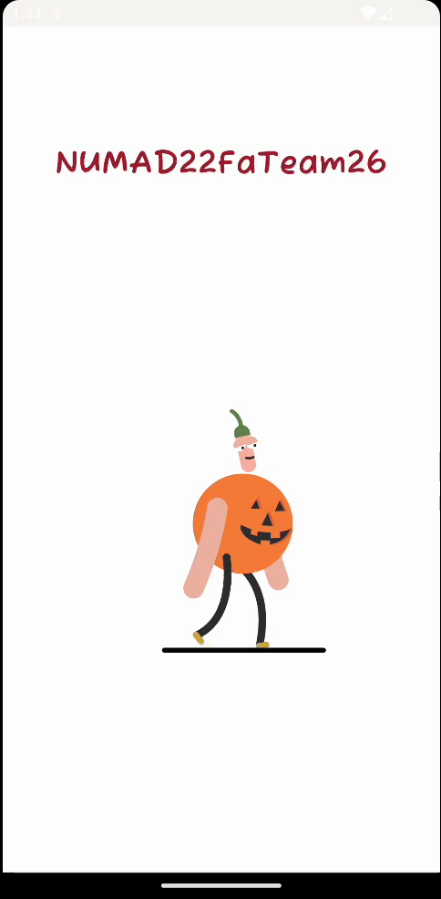
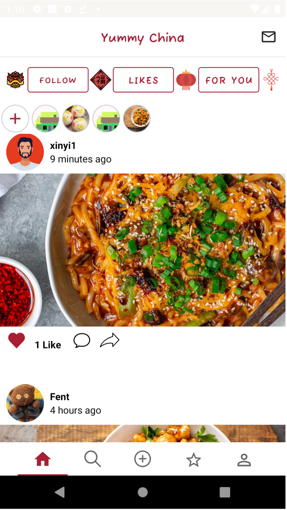
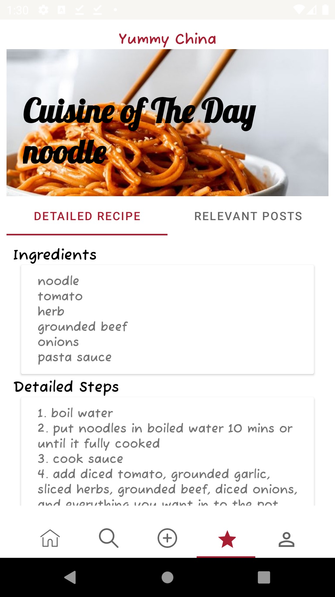
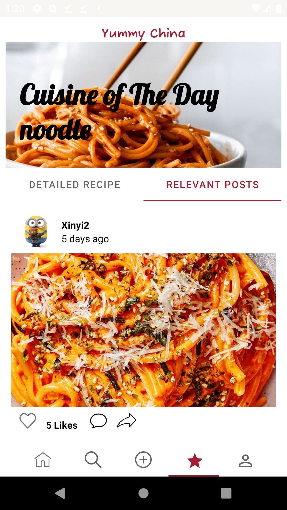
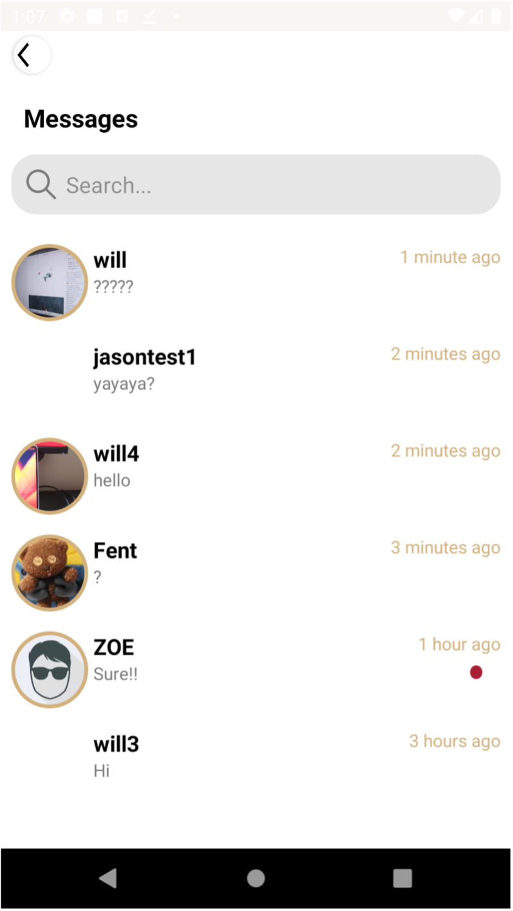
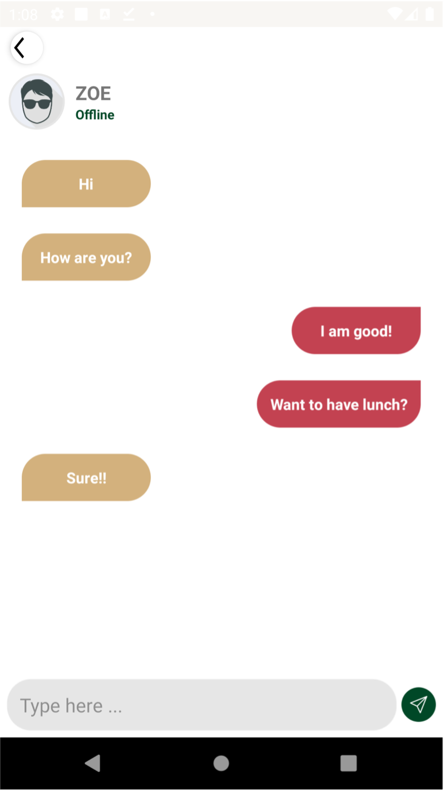
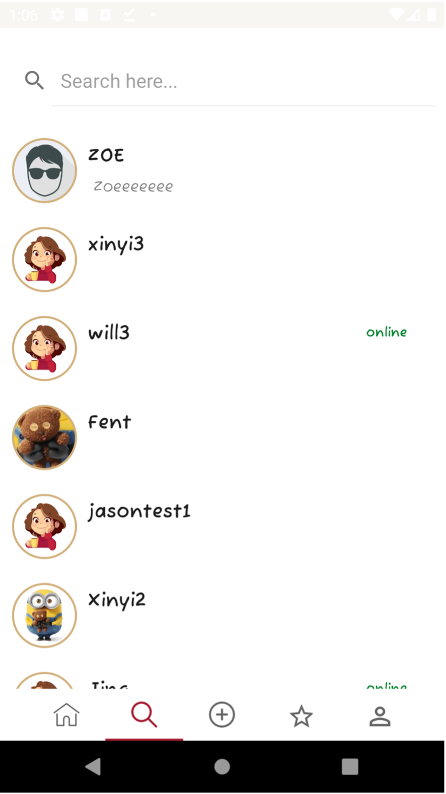

# NUMAD22FaTeam26 -- Yummy China

 

## User login_in/ Onboarding guide:

    
   
    
    
   
    
    

## Choose your picture, create posts and see others posts:

    
   
    
    
    
    

## manage your profile/ view frineds profile and chat:

    
   
    
    
   
    
    

## Team Member :call_me_hand: :two: :six:

:man_technologist:     **Jason Zhang** : [HaozheZhang0818](https://github.com/HaozheZhang0818)

:woman_technologist:   **Xinyi Feng** : [FentPams](https://github.com/FentPams)     

:woman_technologist:   **Jing Ye** : [yej002](https://github.com/yej002)

:man_technologist:     **Mozhi Shen** : [Mozhi21](https://github.com/Mozhi21)

## Overview of our App :iphone:
### :point_right:A8 Stick it to them: 
####  :white_check_mark: Features completed:
-  Sign In & Sign Up with UserName only
-  Sned users with pre-defined sticker
-  Count the stickers have been sent
-  Notifications with pics and text at background and foreground
-  Unread and read messages (Transfer unread message to read by clicking the image)
-  Personalize show the user interface(user name display)
-  About our team UI

### :point_right:A7 at your service: 
- Api use:   [Spoonacular](https://spoonacular.com/food-api)
- This api support **1** request per second, **150** request per day

####  :white_check_mark: Features completed:

:small_orange_diamond: Splash Screen with group name and group member name (animation)

:small_orange_diamond: Dashboard for displaying this assignment button (following assignment buttons are going to be added in future weeks)

:small_orange_diamond: Search Recipes by(all are optional):
  - dish name
  - calories range
  - diet key words:
    - vegan (No ingredients may contain meat or meat by-products, nor may they contain eggs, dairy, or honey.)
    - gluten free(no wheat, barley, rye, and other gluten-containing grains and foods made from them.)
    - keto(The keto diet is based more on the ratio of fat, protein, and carbs in the diet rather than specific ingredients.)
    - :exclamation:The vegan and keto diet is contradictory, when user select both, no dish will be displayed.
    
:small_orange_diamond: The number of recipes shown can be selected by users

:small_orange_diamond: Using shimmer to implement active loading [link](https://github.com/facebook/shimmer-android)

   
