# NUMAD22FaTeam26 -- Yummy China

 
  
  

## When you open the app first time:
  > An easy user log-in system would pop up.
  > 
  > Once log-in, you would be guided by onboarding flash cards. 

    
   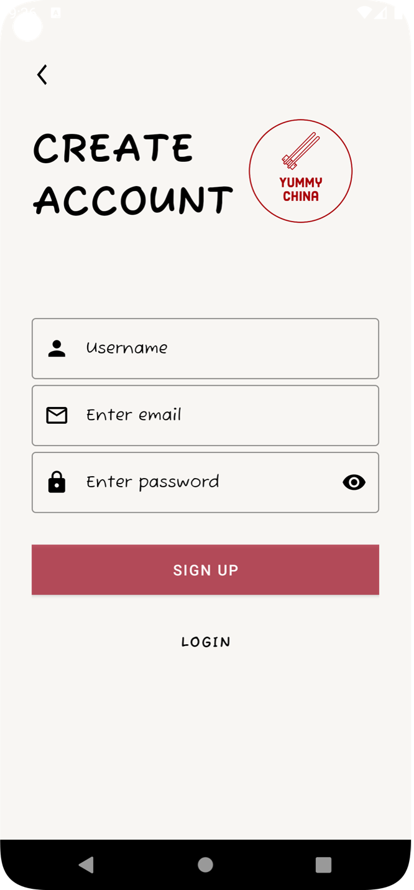
   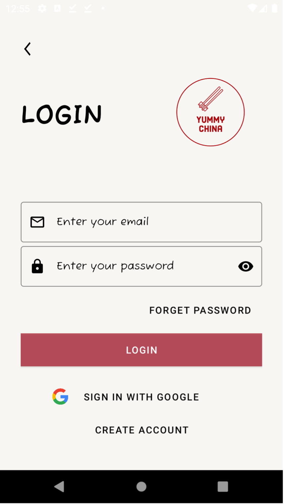 
   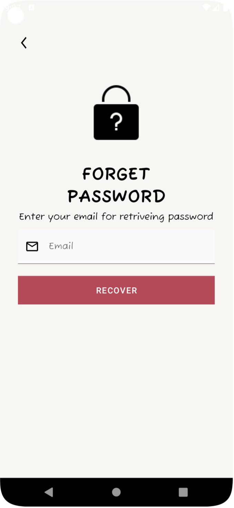 
   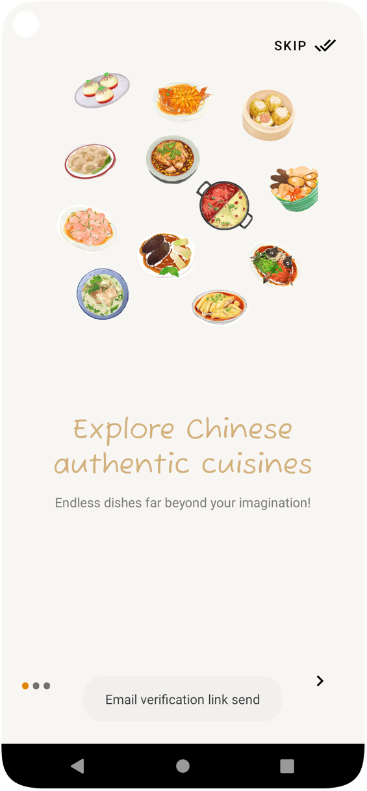
   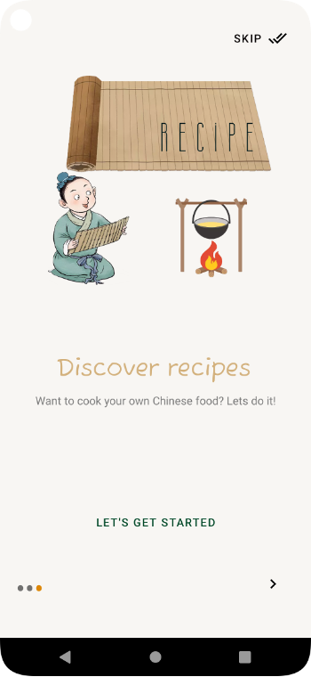 
   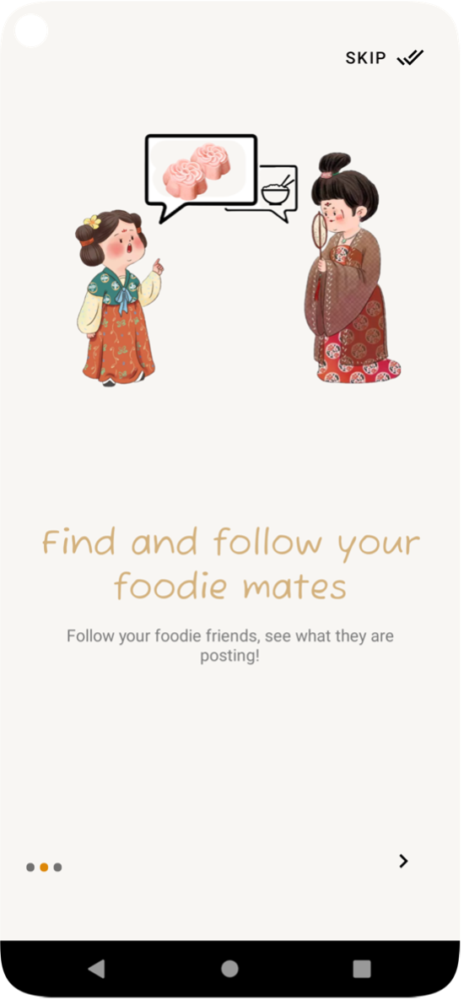 

## On the home page:

 >  View different posts:  posts from friends that you have followed [follow], posts that you have liked [likes], or posts from your beloved themes [for you]
 >  
 > Post "short stories" by clicking the "+" bottom on the upper left, and view friends' "stories" by clicking the following circles.
 > 
 > Click a post to view details & comment of the post. Like, comment or share a post using the following buttons!
 >
 > Click the envenlope on the uper right to view messages.
  

    
   
   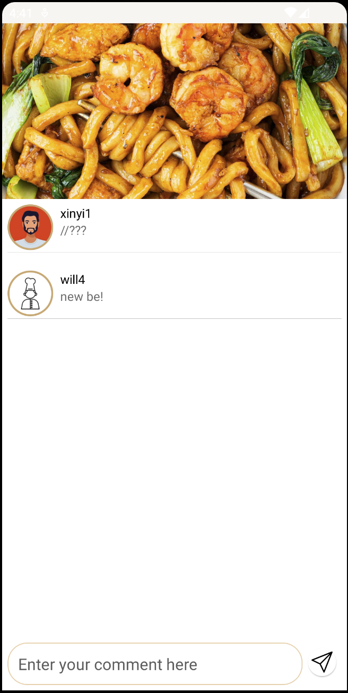 
   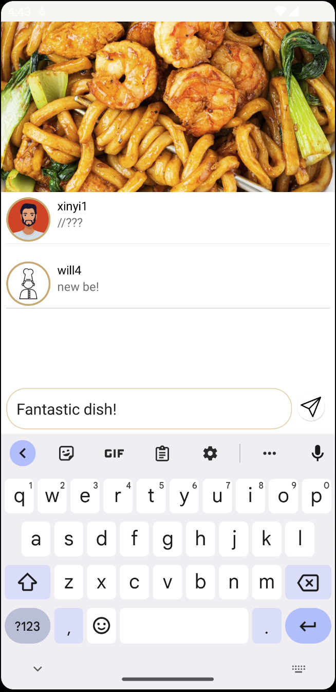 
   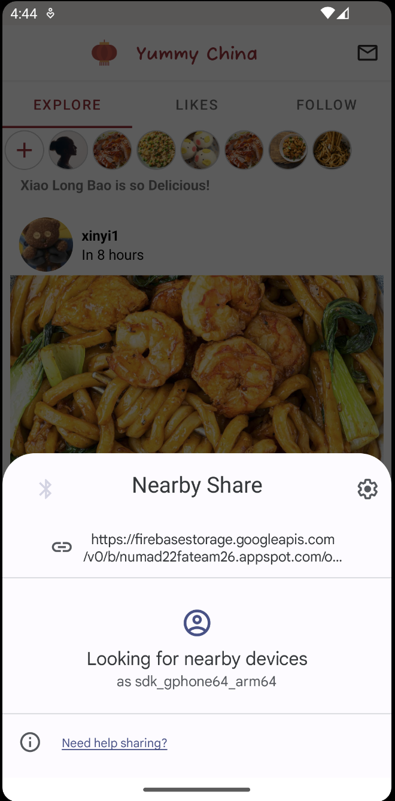
    

## On the search page:
 > Find someone you are interested in, view their profile, follow them and chat with them!
 > 
 > Check if you friends are online or not here
  

    
   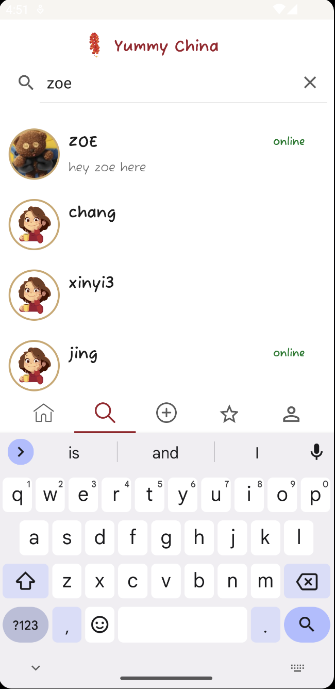
   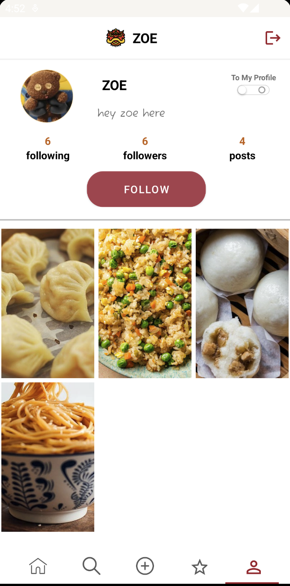 
   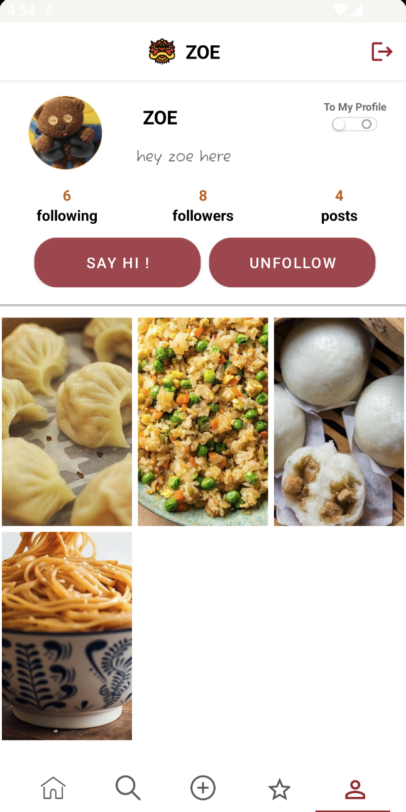 
   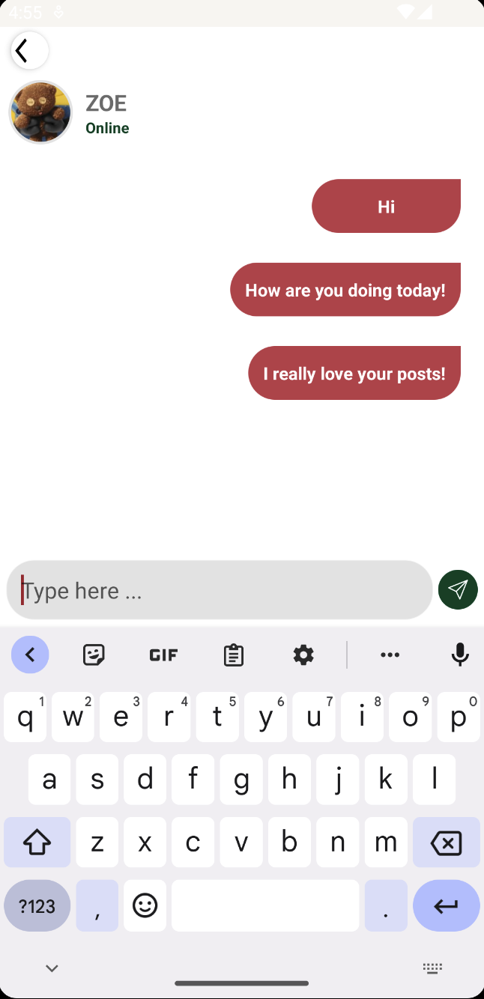

## On the post page:

> Choose the picture you like from your storage and make a post! all your followers would see it immediately so don't forget to say something!

    
   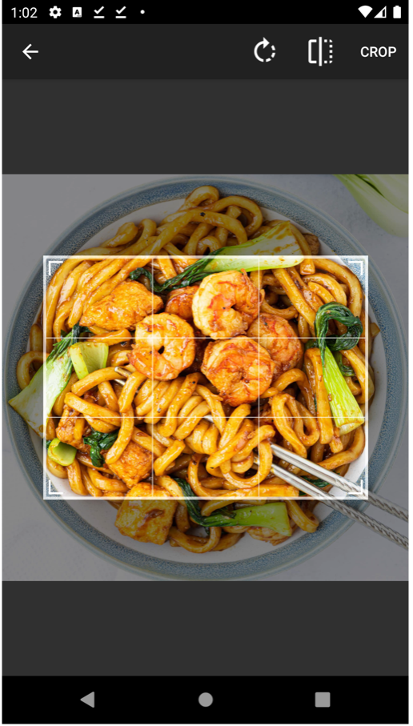
   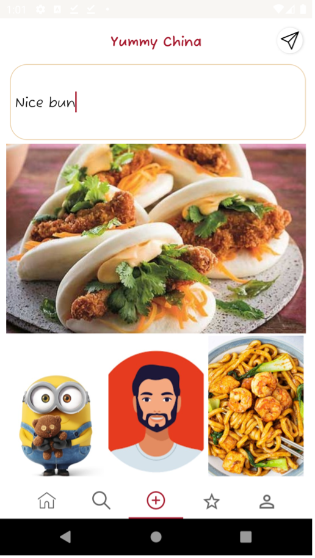 
    
   

## On the recipe page:
 > An editor's recomment dish would be present here to blow your mind！
 > 
 > Detailed recipe would be provided by editors to help you cook your perfect dinner!
 > 
 > And posts which are relevant to this topic would be presented to give you more imformation!

    
   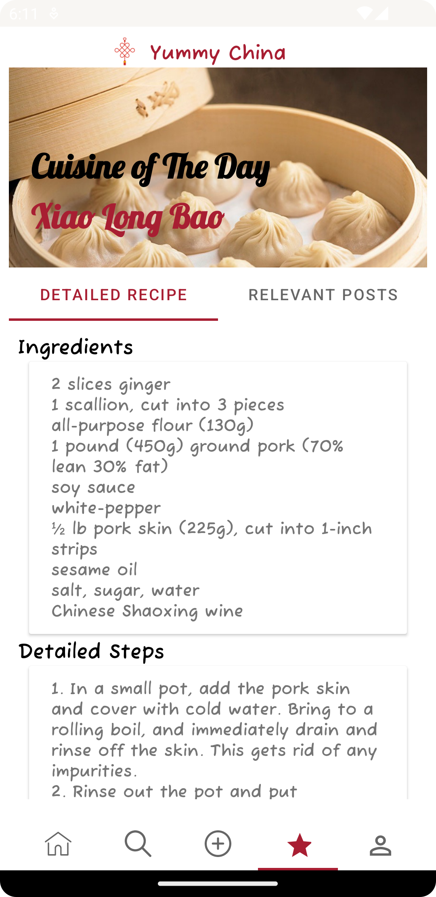
   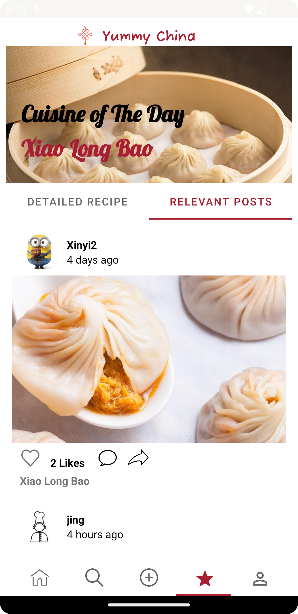 

 
## On the profile page:
> Manage your profile, see how many followers/followees you have, and chat with your friends!
> 
> Quit or switch to another account here。

    
   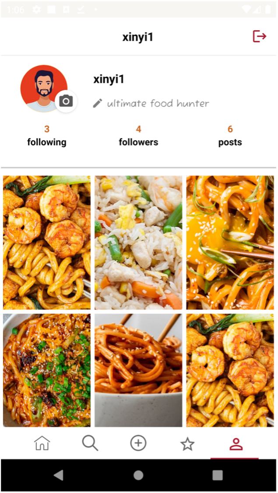
   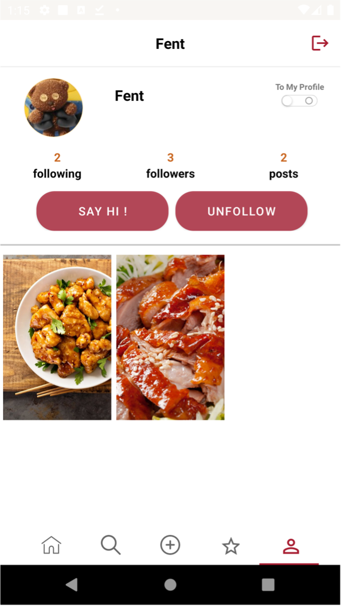 

***
***

## Team Member :call_me_hand: :two: :six:

:man_technologist:     **Jason Zhang** : [HaozheZhang0818](https://github.com/HaozheZhang0818)

:woman_technologist:   **Xinyi Feng** : [FentPams](https://github.com/FentPams)     

:woman_technologist:   **Jing Ye** : [yej002](https://github.com/yej002)

:man_technologist:     **Mozhi Shen** : [Mozhi21](https://github.com/Mozhi21)

## Overview of our App :iphone:
### :point_right:A8 Stick it to them: 
####  :white_check_mark: Features completed:
-  Sign In & Sign Up with UserName only
-  Sned users with pre-defined sticker
-  Count the stickers have been sent
-  Notifications with pics and text at background and foreground
-  Unread and read messages (Transfer unread message to read by clicking the image)
-  Personalize show the user interface(user name display)
-  About our team UI

### :point_right:A7 at your service: 
- Api use:   [Spoonacular](https://spoonacular.com/food-api)
- This api support **1** request per second, **150** request per day

####  :white_check_mark: Features completed:

:small_orange_diamond: Splash Screen with group name and group member name (animation)

:small_orange_diamond: Dashboard for displaying this assignment button (following assignment buttons are going to be added in future weeks)

:small_orange_diamond: Search Recipes by(all are optional):
  - dish name
  - calories range
  - diet key words:
    - vegan (No ingredients may contain meat or meat by-products, nor may they contain eggs, dairy, or honey.)
    - gluten free(no wheat, barley, rye, and other gluten-containing grains and foods made from them.)
    - keto(The keto diet is based more on the ratio of fat, protein, and carbs in the diet rather than specific ingredients.)
    - :exclamation:The vegan and keto diet is contradictory, when user select both, no dish will be displayed.
    
:small_orange_diamond: The number of recipes shown can be selected by users

:small_orange_diamond: Using shimmer to implement active loading [link](https://github.com/facebook/shimmer-android)
